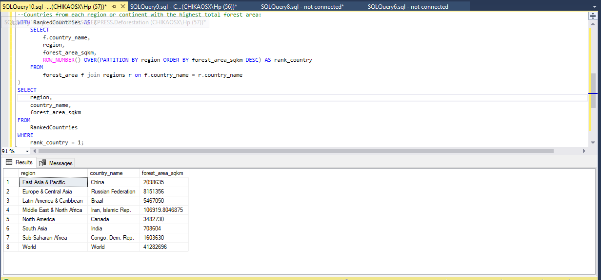

# SQL-Forest-and-Country-Data-Analysis

## Introduction
The "Forest and Country Data Analysis" project is aimed at analyzing data related to deforestation, country statistics, and income groups. This project is conducted to gain insights into the impact of deforestation on different countries and to understand how forested areas correlate with income groups.

## Purpose and Goals
The primary purpose of this project is to explore and analyze information related to deforestation and country characteristics. Specific goals include:
- Analyze deforestation data to determine the total number of countries involved.
- Identify countries within specific total area ranges.
- Find countries with high forest areas compared to their income groups.
- Calculate the average total area and total forest area for different income groups.
- Identify the countries with the highest total forest area in each region or continent.

## Schema Description
This project utilizes a relational database with the following schema components:

Tables: forest_area, land_area, and regions
Relationships: country_code is primary key on forest_area and Foreign key on land_area and regions

## Technology Stack

1. Microsoft SQL Server 

2. SQL (Structured Query Language) 

## Insights and findings obtained from our project:

1. **Total Number of Countries Involved in Deforestation:**
The project identified the total number of countries actively involved in deforestation. This information is crucial for assessing the global scale of deforestation efforts.
```
--Total number of countries involved in deforestation:
SELECT COUNT(*) AS total_deforestation_countries
FROM forest_area;
```


2. **Income Groups of Countries with Total Area Ranging from 75,000 to 150,000:**
The project categorized countries with total land areas between 75,000 and 150,000 square miles into their respective income groups. This analysis provides insights into the income distribution of countries within specific size ranges.
```
--Income groups of countries with total area ranging from 75,000 to 150,000:
SELECT l.country_name, income_group
FROM land_area l join regions r on l.country_name = r.country_name
WHERE total_area_sq_mi BETWEEN 75000 AND 150000;
```


3. **Names of Countries with Forest Area Greater than the Average for "High Income" Group:**
This query identified countries with forest areas exceeding the average for the "High Income" group. These countries may be particularly successful in preserving their forests despite their economic status, suggesting potential conservation strategies for others.
```
--Names of countries with forest area greater than the average for "High Income" group:
SELECT country_name, forest_area_sqkm
FROM forest_area
WHERE forest_area_sqkm > (SELECT AVG(forest_area_sqkm) FROM forest_area f join regions r on f.country_name = r.country_name WHERE income_group = 'High Income');
```


4. **Average Total Area for Different Income Groups:**
By calculating the average total land area for countries in various income groups, the project offers a broad view of land distribution across income categories, which can be valuable for policymakers and planners.
```
--Average total area (in square miles) for "Upper Middle Income" group and comparison with other income groups:
SELECT income_group, AVG(total_area_sq_mi) AS avg_total_area
FROM land_area l join regions r on l.country_name = r.country_name
GROUP BY income_group;
```


5. **Total Forest Area for Different Income Groups:**
This analysis determined the total forested area within different income groups. It reveals how income levels correlate with forested land, shedding light on potential connections between economic development and forest preservation.
```
--Total forest area (in square kilometers) for "High Income" group and comparison with other income groups:
SELECT income_group, SUM(forest_area_sqkm) AS total_forest_area
FROM forest_area f join regions r on f.country_name = r.country_name
GROUP BY income_group;
```


6. **Countries with the Highest Total Forest Area in Each Region or Continent:**
This query identified countries within each region or continent with the highest total forested area. This information is valuable for regional conservation efforts and understanding which countries play key roles in preserving forests at a regional level.
```
--Countries from each region or continent with the highest total forest area:
WITH RankedCountries AS (
    SELECT
        f.country_name,
        region,
        forest_area_sqkm,
        ROW_NUMBER() OVER(PARTITION BY region ORDER BY forest_area_sqkm DESC) AS rank_country
    FROM
        forest_area f join regions r on f.country_name = r.country_name
)
SELECT
    region,
    country_name,
    forest_area_sqkm
FROM
    RankedCountries
WHERE
    rank_country = 1;
```


## Conclusion
The analysis of deforestation, country statistics, and income groups using SQL queries has provided valuable insights into the interplay between these factors. This analysis sheds light on critical aspects of global environmental concerns and socio-economic disparities. Here are the key takeaways from the analysis:

1. **Deforestation Impact:** We determined the total number of countries actively involved in deforestation. This foundational insight highlights the extent of the global challenge of deforestation and the need for concerted conservation efforts.

2. **Income and Land Area:** By categorizing countries based on their income groups within specific total land area ranges, we gained insights into the distribution of economic wealth and land resources. This information is crucial for understanding how economic factors relate to land use.

3. **Forest Conservation Efforts:** We identified countries with forest areas exceeding the average for the "High Income" group. These countries serve as models for successful forest conservation within their respective income categories, offering valuable lessons for sustainable land management.

4. **Income Group Analysis:** Calculating the average total area for different income groups allowed us to assess how income levels correlate with land area. It provides insights into the varying land-use patterns across income groups.

5. **Forest Preservation by Income Group:** The analysis of total forested areas for different income groups revealed the disparities in forest resources among income categories. It emphasizes the importance of considering income levels in global conservation strategies.

6. **Regional Conservation Champions:** By identifying countries with the highest total forest areas in each region or continent, we highlighted key players in regional conservation efforts. These countries can serve as leaders and collaborators in regional environmental initiatives.
